# Mini SOC Lab — Home-Built Security Operations Center

> A hands-on, virtualized SOC environment simulating real-world **attack detection, log analysis, and threat monitoring** using Wazuh SIEM.

<br>

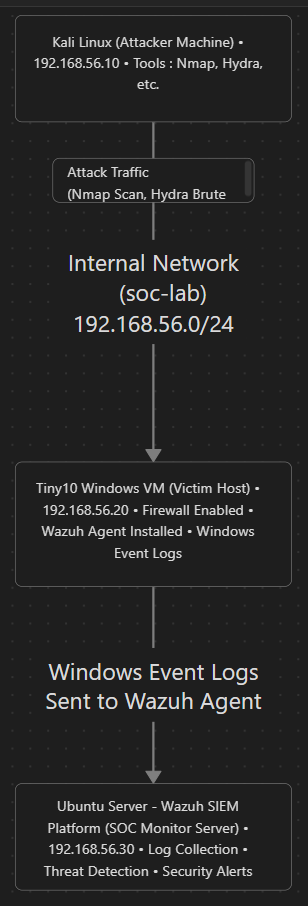

<br>

## Table of Contents

- [About the Project](#-about-the-project)
- [Lab Architecture](#-lab-architecture)
- [Tools & Technologies](#-tools--technologies)
- [Environment Setup](#-environment-setup)
- [Network Validation](#-network-validation)
- [Wazuh SIEM Deployment](#-wazuh-siem-deployment)
- [Wazuh Agent on Windows](#-wazuh-agent-on-windows-victim)
- [File Integrity Monitoring (FIM)](#-file-integrity-monitoring-fim)
- [Attack Simulation](#-attack-simulation)
  - [Reconnaissance — Nmap](#1-reconnaissance--nmap)
  - [Brute Force Attack — Hydra (RDP)](#2-brute-force-attack--hydra-rdp)
- [Detection & Alerting in Wazuh](#-detection--alerting-in-wazuh)
- [MITRE ATT&CK Mapping](#-mitre-attck-mapping)
- [Challenges & Solutions](#-challenges--solutions)
- [Key Learnings](#-key-learnings)
- [Future Enhancements](#-future-enhancements)

<br>

---

## About the Project

This project is a **Mini Security Operations Center (SOC) Lab** built entirely in a virtualized environment using Oracle VirtualBox. It simulates a real-world SOC pipeline from scratch:

```
Attack Simulation → Log Generation → Log Collection → Detection → Analysis
```

The lab was designed to develop practical, hands-on skills in:
- SIEM deployment and configuration
- Network reconnaissance
- Brute-force attack simulation
- Endpoint log monitoring
- Security event correlation and analysis

Everything in this lab is **real** — real attacks, real logs, real detections. No simulated data.

<br>

---

## Lab Architecture

The lab consists of **3 virtual machines** running on a **Host-Only Network** in VirtualBox, completely isolated from the internet.

```
┌─────────────────────────────────────────────────────────────────┐
│                      VirtualBox Host-Only Network               │
│                         Subnet: 192.168.56.0/24                 │
│                                                                  │
│   ┌──────────────┐      ┌──────────────┐     ┌───────────────┐  │
│   │  Kali Linux  │─────▶│  Tiny10 Win  │────▶│  Wazuh SIEM   │  │
│   │  (Attacker)  │      │   (Victim)   │     │   (Monitor)   │  │
│   │ 192.168.56.X │      │192.168.56.102│     │192.168.56.103 │  │
│   └──────────────┘      └──────────────┘     └───────────────┘  │
│        Nmap / Hydra         Wazuh Agent          Wazuh Manager   │
└─────────────────────────────────────────────────────────────────┘
```

| Machine | OS | Role | IP |
|---|---|---|---|
| Attacker | Kali Linux | Runs Nmap, Hydra for attacks | 192.168.56.X |
| Victim | Windows Tiny10 | Target machine, runs Wazuh Agent | 192.168.56.102 |
| SIEM | Ubuntu + Wazuh | Collects logs, detects threats | 192.168.56.103 |

<br>

---

## Tools & Technologies

| Category | Tool |
|---|---|
| Virtualization | Oracle VirtualBox |
| SIEM | Wazuh (Open Source) |
| Attacker OS | Kali Linux |
| Victim OS | Windows Tiny10 |
| Reconnaissance | Nmap |
| Brute Force | Hydra |
| Log Analysis | Wazuh Dashboard |
| Threat Framework | MITRE ATT&CK |

<br>

---

## Environment Setup

### Virtual Machines Created

Three VMs were created in VirtualBox with the following configuration:

| VM | RAM | CPU | Network Adapter |
|---|---|---|---|
| Kali Linux | 2–4 GB | 2 cores | Host-Only |
| Windows Tiny10 | 2 GB | 1–2 cores | Host-Only |
| Wazuh Server | 4 GB | 2 cores | Host-Only |

> All VMs are connected to the **same Host-Only adapter** to ensure they are on the same subnet.

### Screenshots

**Kali Linux Attacker — Network Setup**
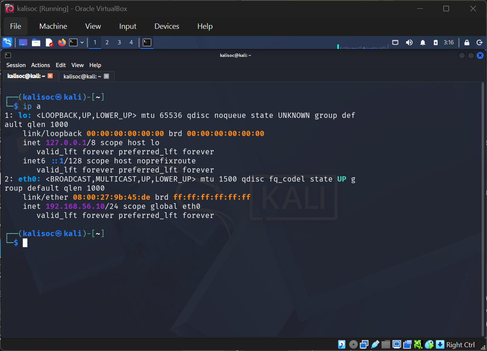

**Windows Tiny10 Victim — Desktop**
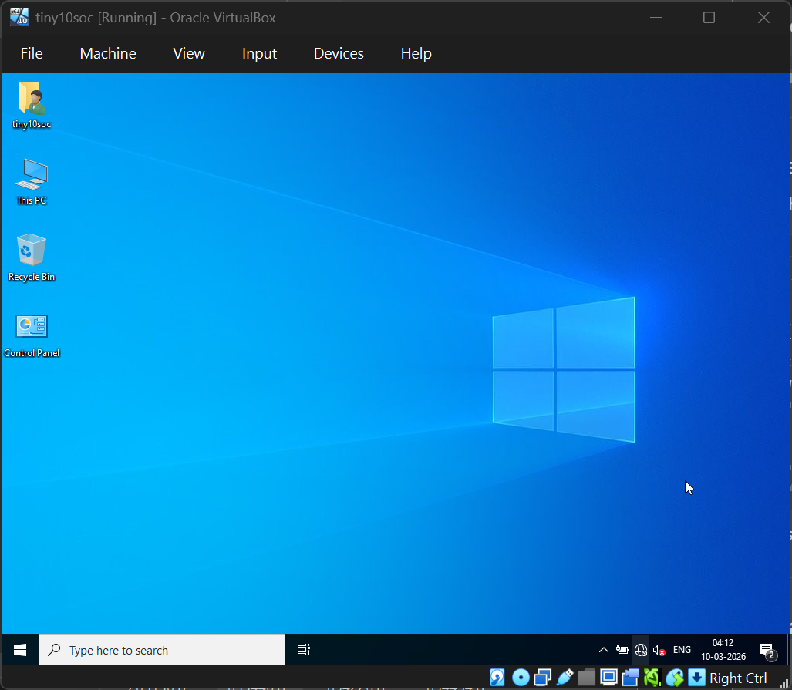

**Windows Firewall Configuration (RDP Enabled)**
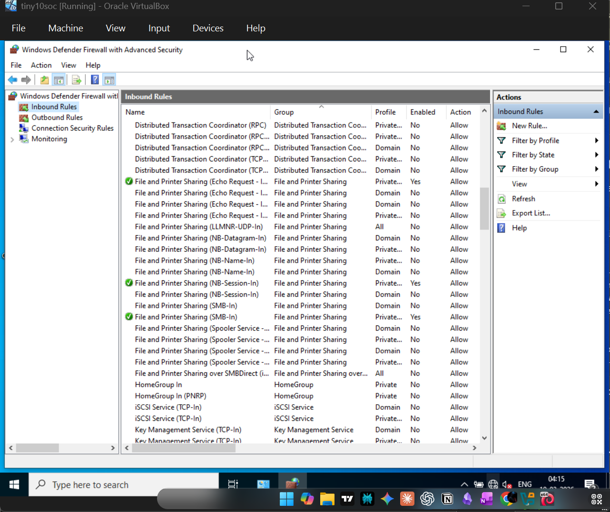

<br>

---

## Network Validation

After setting up the VMs, connectivity was verified using ICMP (ping) between all machines.

**Commands used:**
```bash
# On Kali — ping the victim
ping 192.168.56.102

# On Kali — ping the Wazuh server
ping 192.168.56.103
```

Successful ping responses confirmed that all three machines can communicate with each other.

**Screenshot — Network Connectivity Test**
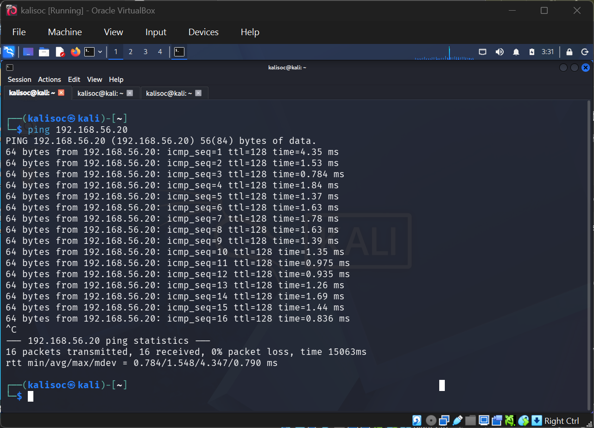

<br>

---

## Wazuh SIEM Deployment

Wazuh was installed on the Ubuntu server using the official automated installation script. It deploys three components:

- **Wazuh Manager** — Core engine for rule processing and detection
- **OpenSearch** — Data indexing and storage
- **Wazuh Dashboard** — Web UI for visualization and analysis

The dashboard was accessed via browser at:
```
https://192.168.56.103
```

### Screenshots

**Wazuh Agent Connected — Overview**
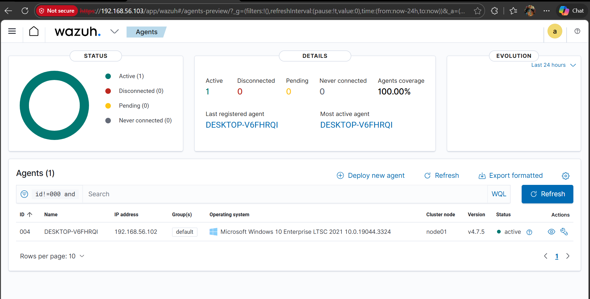

**Wazuh Agent — Detailed Dashboard**
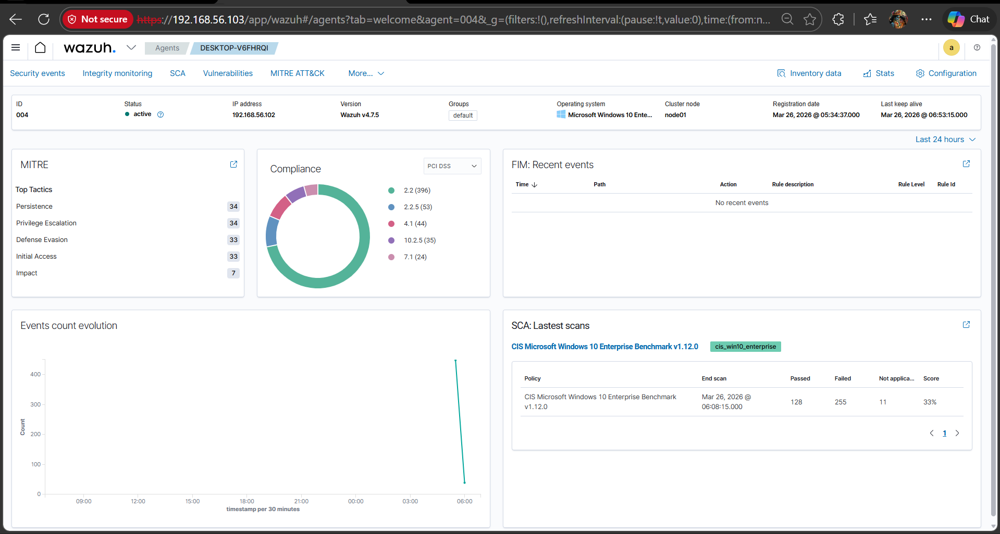

**Wazuh Agent — Monitoring Dashboard**
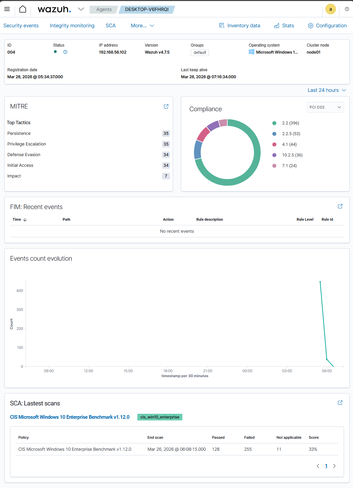

<br>

---

## Wazuh Agent on Windows Victim

The Wazuh Agent was installed on the Windows Tiny10 machine to forward logs to the SIEM.

**Steps:**
1. Downloaded the Wazuh Windows Agent installer
2. Installed with the Wazuh Server IP: `192.168.56.103`
3. Started the agent service
4. Verified connection on the Wazuh Dashboard under **Agents**

**Result:** Agent showed status **Active** 

<br>

---

## File Integrity Monitoring (FIM)

FIM was enabled using Wazuh's built-in `syscheck` module, which monitors specified directories for any file changes.

**Monitored Directories:**
- `C:\Users\<user>\Desktop`
- Other user directories

**Test Actions Performed:**
1. Created a new file on Desktop
2. Modified the file content
3. Deleted the file

**Detection Result:**
Wazuh generated a separate alert for each action — file added, file modified, file deleted — with the file path, timestamp, and event type included.

### Screenshots

**FIM Dashboard Overview**
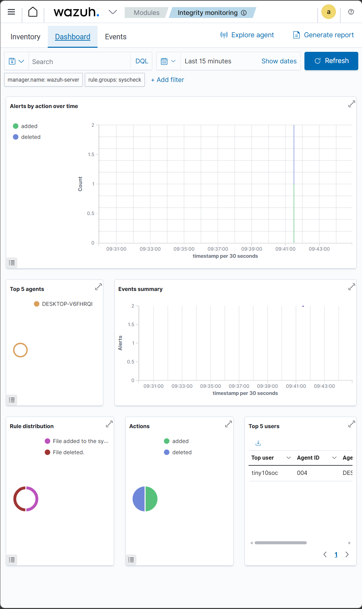

**FIM Events Detection**
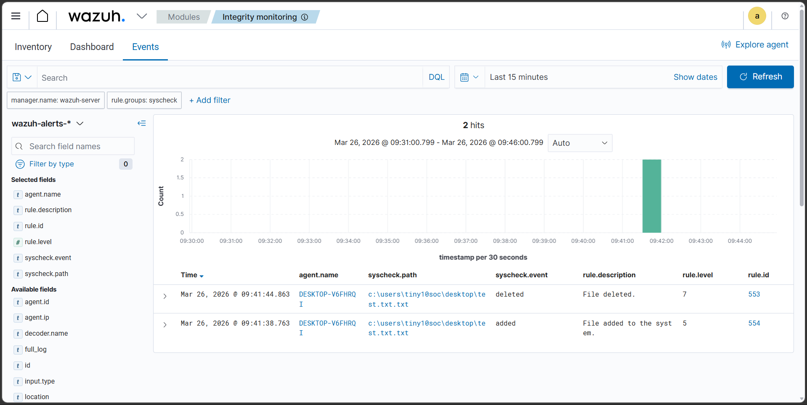

<br>

---

## Attack Simulation

### 1. Reconnaissance — Nmap

**Tool:** Nmap  
**Objective:** Discover open ports and services on the victim machine

**Commands Used:**
```bash
# Full SYN scan
nmap -sS -Pn 192.168.56.102

# Check specific RDP port
nmap -p 3389 192.168.56.102
```

**Ports Discovered:**

| Port | Service | Significance |
|---|---|---|
| 139/tcp | NetBIOS | Legacy Windows sharing |
| 445/tcp | SMB | File sharing, common exploit target |
| 3389/tcp | RDP | Remote Desktop — target for brute force |

### Screenshots

**Network Discovery Scan**
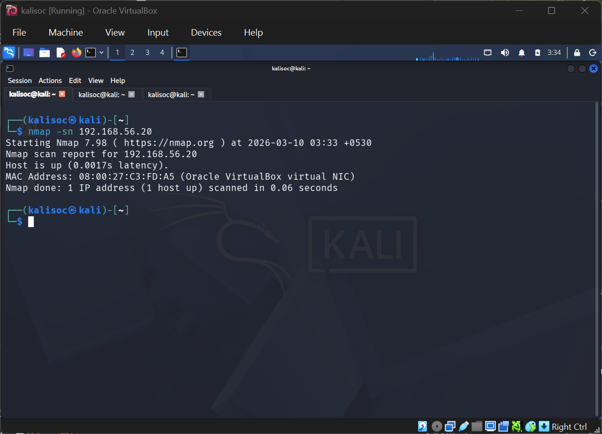

**Nmap Service Scan**
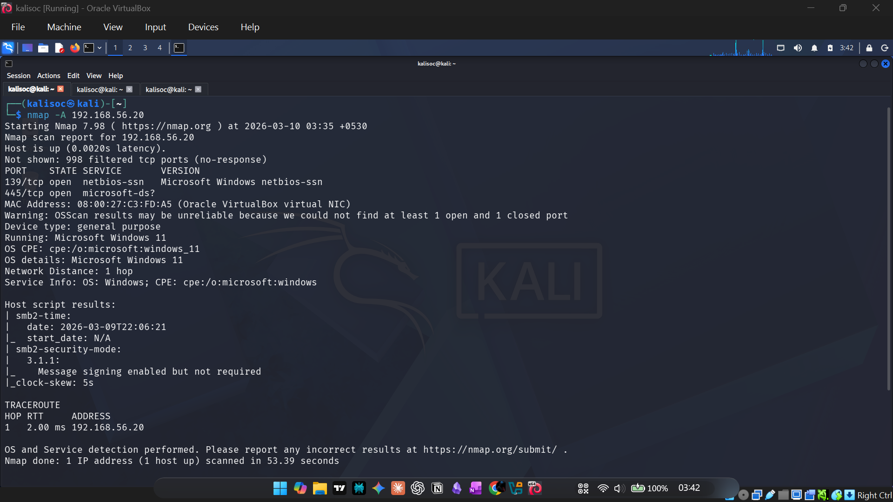

**Nmap Scan Result**
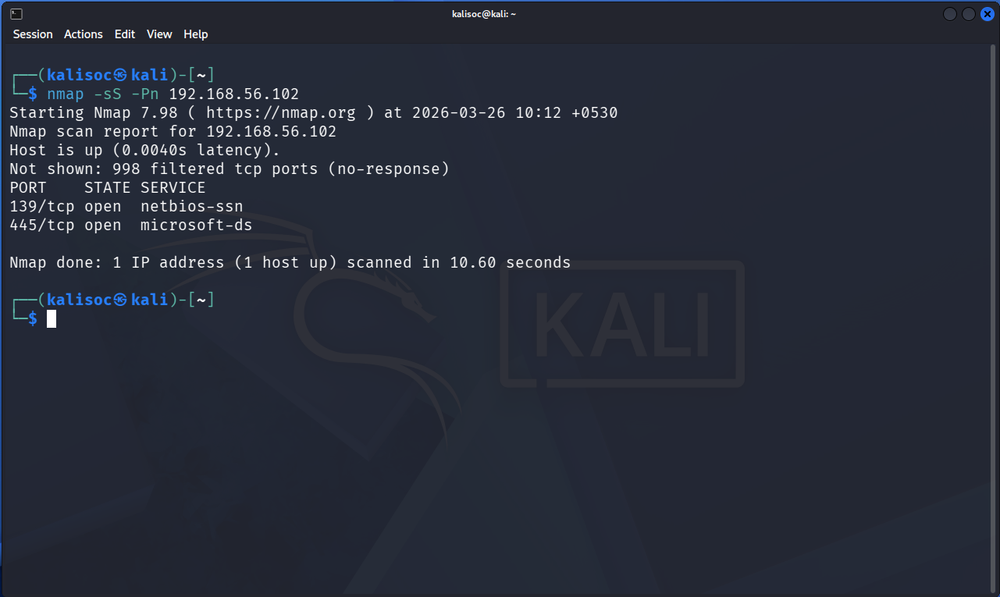

**RDP Port Open Confirmed**
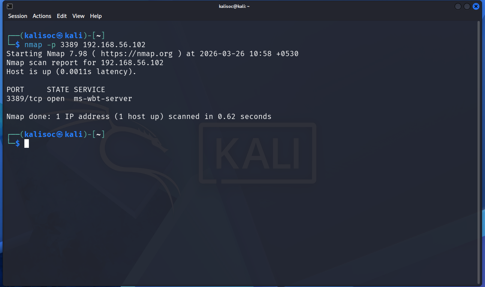

---

### 2. Brute Force Attack — Hydra (RDP)

**Tool:** Hydra  
**Target:** RDP on port 3389  
**Objective:** Simulate credential-based login attack and trigger Wazuh alerts

#### RDP Setup on Victim

Before running Hydra, RDP was enabled on the Windows machine:

```powershell
# Enable Remote Desktop via firewall
netsh advfirewall firewall set rule group="remote desktop" new enable=Yes
```

Verified with: `nmap -p 3389 192.168.56.102` → Status: **OPEN** 

#### Hydra Attack Command

```bash
hydra -l administrator -P attack.txt -t 1 -W 2 rdp://192.168.56.102
```

| Flag | Meaning |
|---|---|
| `-l administrator` | Target username |
| `-P attack.txt` | Custom password wordlist |
| `-t 1` | Single thread (avoid RDP rate limiting) |
| `-W 2` | 2-second delay between attempts |

**Custom Wordlist Used (`attack.txt`):**
```
admin
admin123
password
123456
root
```

> Using a large wordlist like `rockyou.txt` was too slow due to RDP rate limiting. A targeted wordlist was more effective for generating detectable events.

Each attempt generated a **Windows Event ID 4625 (Failed Logon)** on the victim, which was forwarded to Wazuh in real time.

### Screenshots

**RDP Failed Logins on Victim**
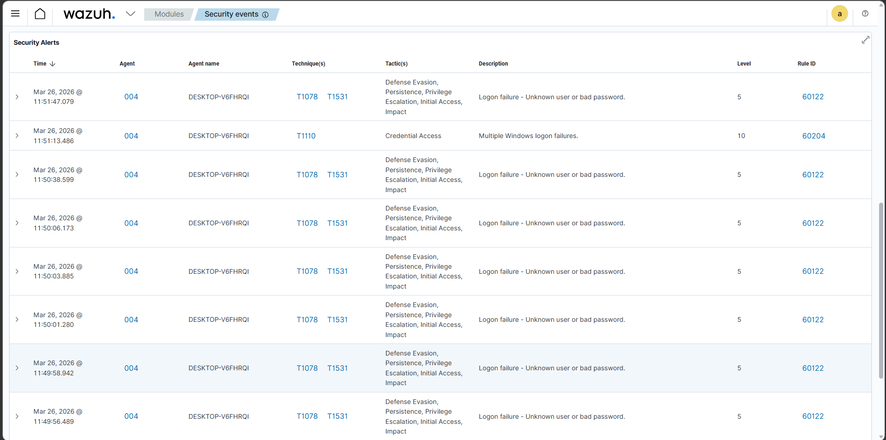

**Brute Force Detected in Wazuh**
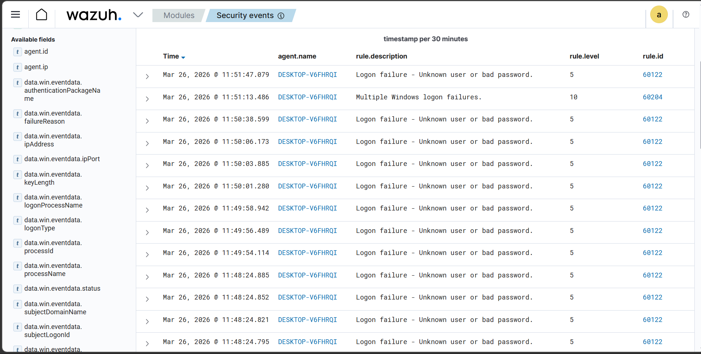

**Failed Login Spike (Alert Timeline)**
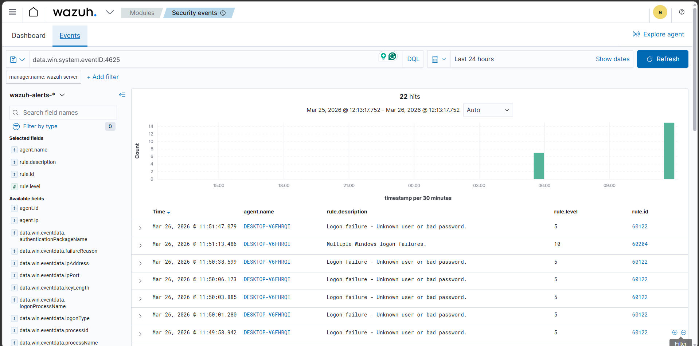

**Alert Details View**
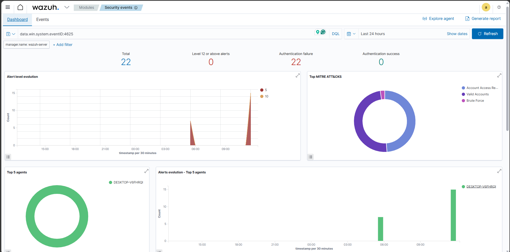

**Brute Force Detection Dashboard**
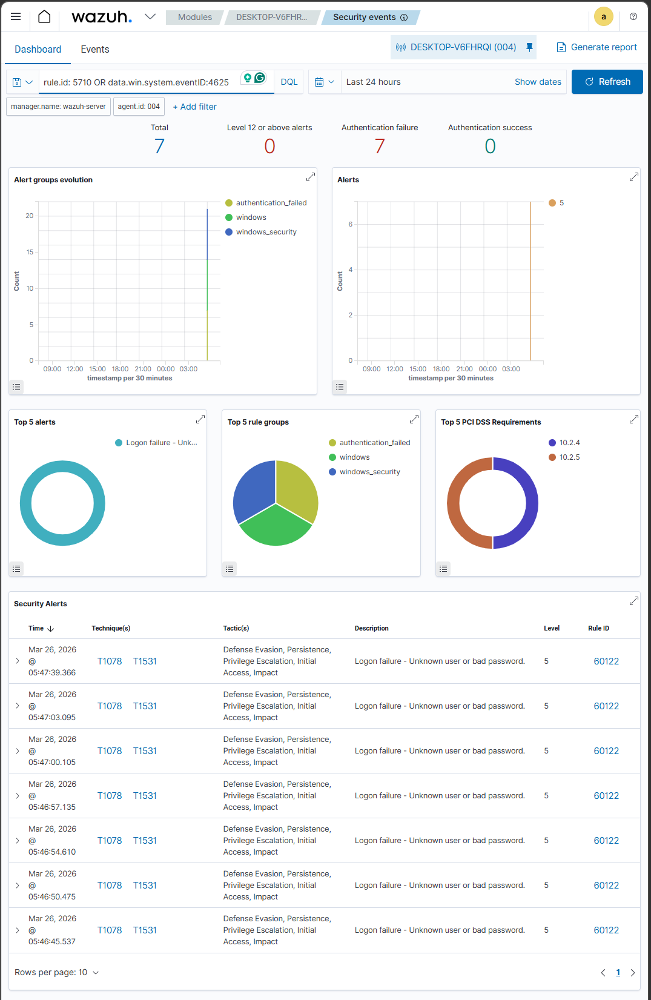

<br>

---

## Detection & Alerting in Wazuh

Wazuh detected and correlated the brute-force events using the following rules:

| Rule ID | Description | Severity Level |
|---|---|---|
| 60122 | Windows logon failure (single event) | Level 5 |
| 60204 | Multiple failed logon attempts (brute-force pattern) | Level 10 |

**Each alert captured:**
- Username attempted
- Source IP address
- Failure reason (`Unknown user or bad password`)
- Logon type
- Process (`svchost.exe`)
- Status codes

**Dashboard showed:**
- Alert spike during the attack window
- Timeline visualization of events
- Event grouping and correlation

<br>

---

## MITRE ATT&CK Mapping

Wazuh automatically mapped detected events to the MITRE ATT&CK framework:

| Technique ID | Name | Description |
|---|---|---|
| T1110 | Brute Force | Multiple failed login attempts via RDP |
| T1078 | Valid Accounts | Attempting to gain access with real credentials |
| T1046 | Network Service Discovery | Nmap scanning for open ports and services |

<br>

---

## Challenges & Solutions

| Challenge | Solution |
|---|---|
| VMs couldn't ping each other | Reconfigured all adapters to same Host-Only network |
| Hydra was extremely slow | Reduced threads (`-t 1`), added delay (`-W 2`), used custom wordlist |
| RDP rate limiting blocking Hydra | Used manual login attempts alongside Hydra to speed up event generation |
| Firewall blocking RDP | Used `netsh` command to allow RDP through Windows Firewall |
| Wazuh agent not connecting | Verified Server IP in agent config and restarted agent service |

<br>

---

## Key Learnings

- How a **SIEM ingests and correlates logs** from endpoints in real time
- How **brute-force attacks** look from both the attacker and defender perspective
- How **Windows Event IDs** (like 4625) map to real security threats
- How **MITRE ATT&CK** is used to classify and contextualize attack techniques
- The importance of **network isolation** when building security labs
- How **FIM** helps detect unauthorized file access and changes at the endpoint level

<br>

---

## Future Enhancements

- [ ] Add malware simulation (e.g., reverse shell, payload delivery)
- [ ] Integrate threat intelligence feeds into Wazuh
- [ ] Set up automated alerting (email/Slack notifications)
- [ ] Deploy additional victim endpoints
- [ ] Implement SOAR (Security Orchestration, Automation, and Response)
- [ ] Add network traffic capture with Wireshark/Zeek
- [ ] Test lateral movement scenarios

<br>

---

## About Me

**Abhishek Prajapat**  
 ECE Undergrad — Swami Keshvanand Institute of Technology, Jaipur  
 Jaipur, Rajasthan, India

Certified SOC Analyst (CSA) and CCNA 200-301 certified, with a strong foundation in incident response, threat detection, SIEM monitoring, log analysis, and network defence. Actively pursuing a career as a **SOC Analyst L1** and building hands-on skills through real-world lab environments like this one.

** Vision** — To grow into a cybersecurity professional who not only responds to threats but also proactively strengthens defence strategies, specialising in purple teaming and advanced SOC operations.

---

Connect with me :

[](https://www.linkedin.com/in/abhii-prajapati6350)
[](https://github.com/Abhii-prajapat)

<br>

---

> *"The best way to learn security is to break things in a safe environment — then understand why they broke."* 